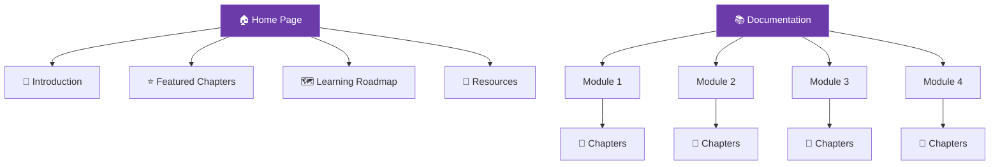

<div align="center">

# 📘 AI-Spec Driven Book


### *🚀 A Modern, Accessible & Spec-Driven Learning Platform*

<br/>

[](https://ai-spec-driven-book-six.vercel.app/)

<br/>

```
✨ Designed for clarity • Built for learning • Engineered for scale ✨
```

<br/>


</div>

<br/>

## 🎯 Quick Overview

<table>
<tr>
<td width="50%">

### 🎨 **Design Philosophy**
- Clean, distraction-free interface
- Focus on readability and comfort
- Modern tech aesthetic with purpose
- Accessibility-first approach

</td>
<td width="50%">

### ⚡ **Performance**
- Lightning-fast load times
- Optimized for all devices
- Global CDN deployment
- Minimal bundle size

</td>
</tr>
</table>

<br/>

## 🎨 Visual Identity & Design System

<div align="center">

| 🎭 Element | 🎨 Design Choice | 💡 Purpose |
|------------|------------------|-----------|
| **Primary Background** | `#FFFFFF` / `#0F0F14` | Maximum readability |
| **Accent Color** | `#6C3BAA` Indigo | Modern, tech-forward feel |
| **Text Color** | `#000000` / `#FFFFFF` | Perfect contrast ratios |
| **Interactive Elements** | Gradient animations | Engaging user experience |
| **Typography** | Archivo + General Sans | Professional & readable |
| **Spacing** | Generous padding | Breathing room for content |

</div>

> 💎 **Design Principle**: Every pixel serves the learning experience

<br/>

<div align="center">


</div>

<br/>

## 🌟 Key Features

<table>
<tr>
<td width="33%" align="center">

### 📚 **Spec-Driven**
Clear, predictable structure for every chapter and module

</td>
<td width="33%" align="center">

### 🎨 **Beautiful UI**
Minimal design that lets content shine

</td>
<td width="33%" align="center">

### ♿ **Accessible**
WCAG 2.1 AA compliant throughout

</td>
</tr>

<tr>
<td width="33%" align="center">

### 🚀 **Blazing Fast**
Optimized performance on Vercel

</td>
<td width="33%" align="center">

### 📱 **Responsive**
Perfect on mobile, tablet, desktop

</td>
<td width="33%" align="center">

### 🤖 **AI-Powered Chatbot**
RAG-based assistant for instant help

</td>
</tr>

<tr>
<td width="33%" align="center">

### 🌍 **Internationalization**
English + Urdu with RTL support

</td>
<td width="33%" align="center">

### 🌓 **Dark Mode**
System-aware theme switching

</td>
<td width="33%" align="center">

### 🔄 **Interactive**
Engaging learning components

</td>
</tr>
</table>

<br/>

## 🧠 What Makes It Special?

<details open>
<summary><b>🎯 Click to explore the unique features</b></summary>

<br/>

### ✅ **Spec-Driven Content Architecture**
```
📦 Every Chapter Follows
  ├─ 📋 Clear Learning Objectives
  ├─ 📖 Structured Content Sections
  ├─ 💡 Interactive Examples
  ├─ 🧪 Practical Exercises
  └─ ✅ Knowledge Checks
```

### ✅ **Minimalist & Elegant Design**
- Zero clutter, maximum focus
- Thoughtful whitespace usage
- Smooth transitions and animations
- Consistent visual language

### ✅ **Accessibility Champions**
- Semantic HTML structure
- ARIA labels and roles
- Keyboard navigation support
- Screen reader optimized
- High contrast ratios
- Focus indicators

### ✅ **Performance Optimized**
- Code splitting for faster loads
- Lazy loading images
- Optimized assets
- CDN delivery worldwide

</details>

<br/>

<div align="center">


</div>

<br/>

## 📚 Learning Modules

<table>
<tr>
<td width="50%">

### 🤖 **Module 1: Robotic Nervous System**
- ROS 2 fundamentals
- Middleware architecture
- Communication patterns
- AI agent integration

### 📐 **Module 2: Robot Kinematics & Structure**
- Links, joints, coordinate frames
- Forward/inverse kinematics
- URDF mapping
- Joint constraints & motion limits

### 🎮 **Module 3: Digital Twin Simulation**
- Gazebo simulation setup
- Unity visualization
- Physics & collision modeling
- Navigation & motion planning

</td>
<td width="50%">

### 👁️ **Module 4: Perception Systems**
- Robot camera models
- LiDAR fundamentals
- IMU sensor fusion
- Building perception pipelines

### 🚀 **Module 5: AI-Robot Brain (NVIDIA Isaac)**
- Isaac Sim architecture
- Synthetic data generation
- Hardware-accelerated VSLAM
- Nav2 path planning

### 🗣️ **Module 6: Vision-Language-Action (VLA)**
- VLA fundamentals
- Voice-to-action systems
- Cognitive planning
- Executing language plans

</td>
</tr>
</table>

<br/>

## 🗺️ Website Architecture



<br/>

<div align="center">


</div>

<br/>

## 🛠️ Tech Stack

<div align="center">

### Frontend Technologies

[](https://reactjs.org/)
[](https://docusaurus.io/)
[](https://www.framer.com/motion/)

### Backend Technologies

[](https://fastapi.tiangolo.com/)
[](https://www.python.org/)
[](https://qdrant.tech/)

### AI & ML Stack

[](https://groq.com/)
[](https://cohere.com/)

### Deployment

[](https://vercel.com/)
[](https://github.com/)

</div>

<br/>

<details>
<summary><b>📦 View Detailed Tech Stack</b></summary>

<br/>

| Technology | Purpose | Why We Use It |
|-----------|---------|---------------|
| ⚛️ **React** | UI Framework | Component reusability, fast rendering |
| 🦖 **Docusaurus** | Documentation Platform | Built for technical content, MDX support |
| ☁️ **Vercel** | Hosting & CI/CD | Instant deployments, global CDN |
| 🎨 **CSS Modules** | Styling | Scoped styles, no conflicts |
| 🔧 **Webpack** | Bundling | Optimized builds, code splitting |

</details>

<br/>

<div align="center">


</div>

<br/>

## 🎯 Design Goals & Achievements

<table>
<tr>
<td align="center" width="25%">

<br/><b>Comfortable Reading</b>
<br/>Long-form optimized
</td>
<td align="center" width="25%">

<br/><b>Modular Content</b>
<br/>Easy to maintain
</td>
<td align="center" width="25%">

<br/><b>Lightning Fast</b>
<br/>< 2s load time
</td>
<td align="center" width="25%">

<br/><b>Universal Access</b>
<br/>All devices supported
</td>
</tr>
</table>

<br/>

## 🤝 Contributing

We ❤️ contributions! Here's how you can help:

<table>
<tr>
<td width="50%">

### 🎨 **Design & UX**
- Improve visual design
- Enhance accessibility
- Optimize mobile experience
- Add dark mode features

</td>
<td width="50%">

### 📝 **Content**
- Write new chapters
- Add examples
- Create exercises
- Fix typos

</td>
</tr>
<tr>
<td width="50%">

### 💻 **Development**
- Fix bugs
- Add features
- Improve performance
- Write tests

</td>
<td width="50%">

### 🌍 **Community**
- Translate content
- Share feedback
- Help others
- Spread the word

</td>
</tr>
</table>

<br/>

<div align="center">

### 📋 Contribution Steps

```bash
# 1. Fork the repository
# 2. Clone your fork
git clone https://github.com/YOUR_USERNAME/ai-spec-driven-book.git

# 3. Create a feature branch
git checkout -b feature/amazing-feature

# 4. Make your changes
# 5. Commit with clear messages
git commit -m "Add: Amazing new feature"

# 6. Push to your fork
git push origin feature/amazing-feature

# 7. Open a Pull Request
```

</div>

<br/>

<div align="center">


</div>

<br/>

## 📊 Project Stats

<div align="center">


</div>

<br/>

## 📬 Connect & Resources

<div align="center">

### 🔗 Important Links

[](https://ai-spec-driven-book-six.vercel.app/)
[](https://github.com/yourusername/ai-spec-driven-book)

<br/>

### 📱 Social Media

[](https://facebook.com/yourpage)
[](https://instagram.com/yourpage)
[](https://x.com/yourhandle)
[](https://linkedin.com/in/yourprofile)

</div>

<br/>

<div align="center">


</div>

<br/>

## 📄 License

<div align="center">

This project is open source and available under the [MIT License](LICENSE).

```
MIT License - Free to use, modify, and distribute
```

</div>

<br/>

<div align="center">


<br/>

## 👨‍💻 Created By


# **Ali Askari**

*Building the future of learning through clean design, clear specs, and modern tooling.*

<br/>

[](https://yourportfolio.com)
[](https://github.com/yourusername)
[](mailto:your.email@example.com)

<br/>

---

<br/>

### 💝 Support This Project

<br/>

If this project helps you learn and grow, consider supporting it:

<br/>

[](https://github.com/yourusername/ai-spec-driven-book)
[](https://twitter.com/intent/tweet?text=Check%20out%20this%20amazing%20AI%20learning%20platform!&url=https://ai-spec-driven-book-six.vercel.app/)
[](https://github.com/yourusername/ai-spec-driven-book/blob/main/CONTRIBUTING.md)

<br/>

---

<br/>

### 📈 Roadmap

- [x] Initial release with 4 modules
- [x] Dark mode implementation
- [x] Mobile optimization
- [ ] Interactive code playgrounds
- [ ] Video tutorials integration
- [ ] Community discussion forum
- [ ] Multi-language support
- [ ] Advanced search functionality

<br/>

---

<br/>


<br/>

**Made with ❤️ and ☕ by Ali Askari**

*Last Updated: December 2024*

</div>