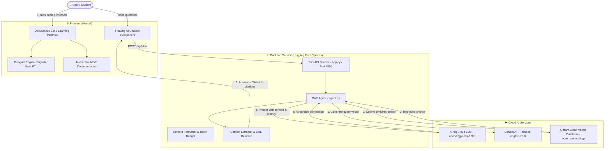

<div align="center">

# 📘 Foundations of Physical AI & Humanoid Robotics
### *A Spec-Driven, Modern & Accessible Learning Platform with Embedded RAG AI Chatbot*

<p align="center">
  
  
  
  
  
  
  
</p>

<br/>

[](https://ai-powered-book.vercel.app/)
[](https://huggingface.co/spaces/AliAskariFace/backend-chatbot-book)
[](https://github.com/AliAskariGithub/Hackathon-01-AI-Book)

<br/>

```
✨ Embodied Intelligence • ROS 2 • Digital Twins • Isaac Sim • VLA Systems ✨
```

<br/>


</div>

<br/>

## 🎯 Quick Overview

<table>
<tr>
<td width="50%">

### 📚 **Foundations of Physical AI**
An end-to-end curriculum bridging digital intelligence with physical embodiments. Teaches students and roboticists how to model, simulate, perceive, and control humanoid robots using modern AI paradigms.

- **Curriculum**: 6 deep technical modules + Intro
- **Frameworks**: ROS 2, Gazebo, Unity, NVIDIA Isaac Sim
- **Autonomy Pipeline**: Perception, VSLAM, Nav2, VLA (Vision-Language-Action)
- **Accessibility**: Multi-language (English + Urdu RTL)

</td>
<td width="50%">

### 🤖 **Embedded RAG Chatbot**
A conversational AI reading companion built right into the platform to answer questions, explain concepts, and navigate the curriculum with exact citations.

- **LLM Inference**: Groq Cloud (`openai/gpt-oss-120b`, `qwen/qwen3.8-27b`)
- **Semantic Embeddings**: Cohere `embed-english-v3.0`
- **Vector Store**: Qdrant Cloud (`book_embeddings`)
- **Interactive Citations**: Direct clickable links to chapters

</td>
</tr>
</table>

<br/>

## 🌟 Key Platform Features

<table>
<tr>
<td width="33%" align="center">

### 📚 **Spec-Driven Architecture**
Rigorous design specs for modules, components, APIs, and accessibility guidelines in `specs/`.

</td>
<td width="33%" align="center">

### 🤖 **Context-Aware AI Assistant**
Embedded RAG chatbot with greetings, identity awareness, curriculum navigation, and citations.

</td>
<td width="33%" align="center">

### ♿ **WCAG 2.1 AA Accessible**
High contrast ratios, semantic HTML, ARIA tags, screen reader optimizations, and keyboard navigation.

</td>
</tr>

<tr>
<td width="33%" align="center">

### 🌍 **Bilingual with Native RTL**
Full internationalization in English and Urdu (`ur`) with tailored bidirectional layout switching.

</td>
<td width="33%" align="center">

### ⚡ **High-Speed Cloud Inference**
Ultra-low latency responses powered by Groq LPU inference engines and async FastAPI streaming.

</td>
<td width="33%" align="center">

### 🌓 **Adaptive Dark & Light Themes**
Sleek glassmorphism, tailored contrast palettes, and system-synchronized color theme switching.

</td>
</tr>
</table>

<br/>

<div align="center">


</div>

<br/>

## 📚 Complete Curriculum & Learning Modules

The textbook delivers a complete, hands-on learning roadmap for embodied artificial intelligence:

| Module | Title | Key Topics & Focus | Primary Documentation |
|:---:|:---|:---|:---:|
| 📖 | **Introduction** | Embodied intelligence vs. software-only AI, humanoid robotics landscape, and autonomy pipeline overview. | [`/docs/intro`](https://ai-powered-book.vercel.app/docs/intro) |
| 1 | **The Robotic Nervous System** | ROS 2 middleware architecture, DDS, computational graphs (Nodes, Topics, Services, Actions), and AI agent integration. | [`/docs/module-1/index`](https://ai-powered-book.vercel.app/docs/module-1/index) |
| 2 | **Robot Kinematics & Structure** | Links, joints, coordinate frames, forward & inverse kinematics, joint constraints, and URDF modeling for real & simulated robots. | [`/docs/module-2/index`](https://ai-powered-book.vercel.app/docs/module-2/index) |
| 3 | **The Digital Twin** | Gazebo simulation setup, physics & collision modeling, navigation, motion planning, and Unity visualization. | [`/docs/module-3/index`](https://ai-powered-book.vercel.app/docs/module-3/index) |
| 4 | **Perception Systems for Robots** | Robot camera models (RGB, Depth, Stereo), LiDAR fundamentals, IMU data, sensor fusion, and ROS 2 perception pipelines. | [`/docs/module-4/index`](https://ai-powered-book.vercel.app/docs/module-4/index) |
| 5 | **The AI-Robot Brain (NVIDIA Isaac)** | NVIDIA Isaac Sim architecture, synthetic data generation, Isaac ROS hardware-accelerated VSLAM, and Nav2 path planning. | [`/docs/module-5/index`](https://ai-powered-book.vercel.app/docs/module-5/index) |
| 6 | **Vision–Language–Action (VLA)** | VLA model fundamentals, voice-to-action systems, cognitive planning, and executing language-guided plans in ROS 2. | [`/docs/module-6/index`](https://ai-powered-book.vercel.app/docs/module-6/index) |

<br/>

<div align="center">


</div>

<br/>

## 🗺️ Monorepo System Architecture


```mermaid
graph TD
    User([👤 User / Student])
    
    subgraph Frontend ["🌐 Frontend (Vercel)"]
        UI[Docusaurus 3.9.2 Learning Platform]
        Locales[Bilingual Engine: English / Urdu RTL]
        Widget[Floating AI Chatbot Component]
        Docs[Interactive MDX Documentation]
    end

    subgraph Backend ["🤗 Backend Service (Hugging Face Spaces)"]
        API[FastAPI Service - app.py / Port 7860]
        Agent[RAG Agent - agent.py]
        Context[Context Formatter & Token Budget]
        Citations[Citation Extractor & URL Rewriter]
    end

    subgraph AICloud ["☁️ Cloud AI Services"]
        Groq[Groq Cloud LLM - openai/gpt-oss-120b]
        Cohere[Cohere API - embed-english-v3.0]
        Qdrant[Qdrant Cloud Vector Database - book_embeddings]
    end

    User -->|Reads book & interacts| UI
    UI --> Docs
    UI --> Locales
    User -->|Asks questions| Widget
    Widget -->|POST /api/chat| API
    API --> Agent
    Agent -->|1. Generate query vector| Cohere
    Agent -->|2. Cosine similarity search| Qdrant
    Qdrant -->|3. Retrieved chunks| Agent
    Agent -->|4. Prompt with context & history| Groq
    Groq -->|5. Grounded completion| Agent
    Agent --> Citations
    Citations -->|6. Answer + Clickable citations| Widget
```

<br/>

<div align="center">


</div>

<br/>

## 🛠️ Complete Tech Stack

<div align="center">

### Frontend Ecosystem
[](https://react.dev/)
[](https://docusaurus.io/)
[](https://mdxjs.com/)
[](https://lucide.dev/)

### Backend & Cloud AI
[](https://fastapi.tiangolo.com/)
[](https://www.python.org/)
[](https://groq.com/)
[](https://cohere.com/)
[](https://qdrant.tech/)

### Infrastructure & Deployment
[](https://vercel.com/)
[](https://huggingface.co/)
[](https://www.docker.com/)
[](https://github.com/)

</div>

<br/>

---

## 📁 Repository Structure

```
hackathon-ai-book/
├── fullstack/
│   ├── frontend-book/             # Docusaurus 3.9.2 learning platform
│   │   ├── docs/                  # Markdown & MDX content (Intro + Modules 1 to 6)
│   │   ├── i18n/                  # Urdu translation & RTL configuration
│   │   ├── src/
│   │   │   ├── components/Chatbot/# RAG Floating Chatbot React widget
│   │   │   └── pages/             # Landing page & custom views
│   │   ├── docusaurus.config.js   # Site metadata, i18n & backend URL config
│   │   ├── sidebars.js            # Structured sidebar navigation
│   │   └── package.json
│   │
│   └── backend/                   # FastAPI RAG Chatbot Service
│       ├── app.py                 # FastAPI application routes (/health, /api/chat)
│       ├── agent.py               # RAG query processing, conversation state & Groq integration
│       ├── models.py              # Data models, prompts & exception classes
│       ├── retrieval.py           # Cohere embedding client & Qdrant semantic search
│       ├── ingest_local.py        # Vector embedding ingestion script (145 chunks ingested)
│       ├── validate_config.py     # Startup configuration and credential validator
│       ├── deploy_to_hf.py        # Automated Hugging Face Spaces deployment script
│       ├── Dockerfile             # Container configuration for Hugging Face Spaces
│       ├── requirements.txt       # Production dependencies
│       └── test/                  # Pytest test suite (44 unit tests)
│
├── specs/                         # Specification documentation
│   ├── 001-rag-embeddings-retrieval/
│   ├── 002-conversational-agent/
│   ├── 003-fastapi-chatbot/
│   └── ...
├── vercel.json                    # Vercel Monorepo build and routing configuration
├── CLAUDE.md                      # Development workflow and coding rules
└── README.md                      # Project master documentation
```

<br/>

<div align="center">


</div>

<br/>

## 🚀 Getting Started Locally

### Prerequisites
- **Node.js**: `v18.0` or higher (`v20+` recommended)
- **Python**: `3.11` or higher
- **API Keys**:
  - [Groq API Key](https://console.groq.com/)
  - [Cohere API Key](https://dashboard.cohere.com/)
  - [Qdrant Cloud URL & API Key](https://cloud.qdrant.io/)

---

### 1. Clone the Repository

```bash
git clone https://github.com/AliAskariGithub/Hackathon-01-AI-Book.git
cd Hackathon-01-AI-Book
```

---

### 2. Configure & Run the Backend Service

```bash
cd fullstack/backend

# Create and activate virtual environment
python -m venv venv
# Windows:
.\venv\Scripts\activate
# Linux / macOS:
source venv/bin/activate

# Install dependencies
pip install -r requirements.txt

# Copy example environment file
cp .env.example .env
```

Configure your `.env` file in `fullstack/backend/`:
```ini
COHERE_API_KEY=your_cohere_key
QDRANT_URL=https://your-cluster.qdrant.io:6333
QDRANT_API_KEY=your_qdrant_key
GROQ_API_KEY=gsk_your_groq_key
GROQ_MODEL=openai/gpt-oss-120b
BOOK_BASE_URL=https://ai-powered-book.vercel.app
ALLOWED_ORIGINS=http://localhost:3000,http://localhost:8000,https://ai-powered-book.vercel.app
```

**Validate Configuration & Run:**
```bash
# Validate credentials
python validate_config.py

# Ingest book embeddings into Qdrant (if not already populated)
python ingest_local.py

# Run unit tests
pytest

# Start the FastAPI server
uvicorn app:app --host 0.0.0.0 --port 8000 --reload
```
API will be live at `http://localhost:8000`. Test health: `curl http://localhost:8000/health`.

---

### 3. Configure & Run the Frontend

In a new terminal:
```bash
cd fullstack/frontend-book

# Install dependencies
npm install

# Start local development server
npm run start
```
The site will open at `http://localhost:3000/`. The chat widget will automatically connect to your local or cloud backend.

---

### 4. Build for Production

```bash
cd fullstack/frontend-book
npm run build
```
Generates optimized static assets for both `en` and `ur` in `build/`.

<br/>

<div align="center">


</div>

<br/>

## 🌐 Production Deployments

### Frontend on Vercel
- **Production URL**: [https://ai-powered-book.vercel.app/](https://ai-powered-book.vercel.app/)
- Configured via root [vercel.json](file:///c:/Hackathons/hackathon-ai-book/vercel.json) for seamless monorepo static deployment with multi-lingual routing and CDN distribution.

### Backend on Hugging Face Spaces
- **Space Repository**: [https://huggingface.co/spaces/AliAskariFace/backend-chatbot-book](https://huggingface.co/spaces/AliAskariFace/backend-chatbot-book)
- **Live Endpoint**: `https://aliaskariface-backend-chatbot-book.hf.space`
- **Dockerized Container**: Configured with non-root security (`appuser:1000`) and port `7860`.
- **Health Check**:
  ```bash
  curl https://aliaskariface-backend-chatbot-book.hf.space/health
  # {"status":"healthy","version":"1.0.0","dependencies":{"cohere":true,"qdrant":true,"groq":true}}
  ```

<br/>

<div align="center">


</div>

<br/>

## 📈 Roadmap & Achievements

- [x] Full curriculum release (Introduction + 6 comprehensive Physical AI modules)
- [x] Embedded RAG AI Assistant with Groq LLMs & Qdrant Cloud vector search
- [x] Smart intent routing (warm greetings, identity awareness, curriculum table of contents)
- [x] Interactive citation badges with direct internal book links
- [x] Multi-language support: English + Urdu with full RTL text rendering
- [x] WCAG 2.1 AA Accessibility compliance and keyboard navigation
- [x] Dark / Light adaptive theme modes
- [x] Zero-secret security isolation (`.gitignore`, `.dockerignore`)
- [x] Live cloud deployments on Vercel and Hugging Face Spaces
- [ ] Interactive code simulation playgrounds in the browser
- [ ] Voice-enabled interactive speech input for the RAG assistant

<br/>

---

## 🤝 Contributing

Contributions are welcome! Please follow these steps:

1. **Fork** the repository: [https://github.com/AliAskariGithub/Hackathon-01-AI-Book](https://github.com/AliAskariGithub/Hackathon-01-AI-Book)
2. **Create a branch**: `git checkout -b feature/your-feature-name`
3. **Commit your changes**: `git commit -m "Add: your feature description"`
4. **Push to branch**: `git push origin feature/your-feature-name`
5. **Open a Pull Request** detailing your changes.

<br/>

## 📄 License

This project is licensed under the [MIT License](LICENSE) — free to use, modify, and distribute for educational and commercial purposes.

<br/>

<div align="center">


<br/>

## 👨‍💻 Author


# **Ali Askari**

*Architecting the future of Physical AI & Robotics education with modern spec-driven engineering.*

[](https://github.com/AliAskariGithub)
[](https://ai-powered-book.vercel.app/)
[](https://huggingface.co/AliAskariFace)

<br/>


<br/>

**Built with ❤️ for the Global AI & Robotics Community**

</div>